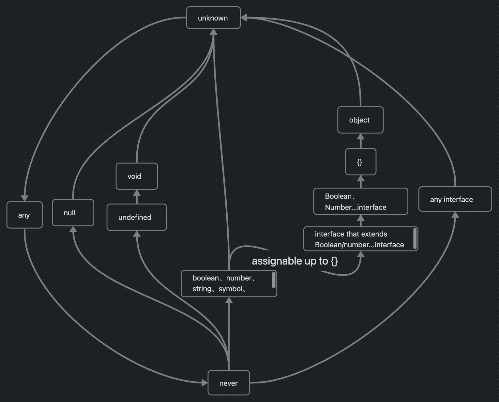

## TypeScript的定位
- JavaScript的超集
- 编译期行为
- 不引入额外开销
- 不改变运行时行为
- 始终与 ESMAScript 语言标准一致 (stage 3语法)

## 类型
### 类型变量定义
类型变量的方式有三种，分别为 `type`、`interface`、`enum`，他们都相当于 JS 中的 `const`，**一旦定义就不可改变**，三者的区别是：

- `enum`：仅用来定义枚举类型；
- `interface`：可以用来定义函数、对象、类；
- `type`：使用绝大多数类型，例如普通的值、对象、函数、数组、元组等。
Ï
### 类型基础
**JS 中合法的值，在 TS 类型中同样合法，也就是 _TS 类型的值 = TS 基础类型 + JS 值_，并且可以混用。**


> 类型之间的并集（`|`）会向上取顶部的类型。即`never | 'a' => 'a'`，`unknown | 'a' => 'unknown'` 

> 类型之间的交集（`&`）会向下取底部的类型。即`never & 'a' = never`，`unknown & 'a' => 'a'`

- 布尔：`boolean`
- 数字：`number`
- 字符串：`string`
- 数组：`number[]` / `Array<number>`
- 元组：`[number, string]`
- 枚举：`enum Color{ RED, GREEN, BLUE }`
- `any`
- `void`
- `null`、`undefined`
- `never`
- `object`

#### never
*是其他任意类型的子类型的类型被称为底部类型*
- 表示那些在正常执行流程中永远不会返回的值的类型。它在类型系统中的作用是帮助开发者进行全面性的类型检查，确保代码的覆盖性和错误处理的完整性
- never 类型便为空类型和底部类型；never 类型的变量无法被赋值，与其他类型求交集为自身，求并集不参与运算
##### 出现情况
- 函数抛出异常
- 函数无法正常返回
- 类型保护的 exhaustive check
``` typescript
function throwError(message: string): never {
  throw new Error(message);
}
function infiniteLoop(): never {
  while (true) {
    // 无限循环
  }
}
type Foo = { type: 'foo', data: number };
type Bar = { type: 'bar', data: string };
type Baz = { type: 'baz', data: boolean };
type MyType = Foo | Bar | Baz;

function processMyType(obj: MyType): never {
  // 当所有可能的类型都被处理时，触发错误
  throw new Error('Unhandled type: ' + obj.type);
}

```
##### 应用
######  联合类型中的过滤
``` typescript
type Exclude<T, U> = T extends U ? never : T;
// 相当于: type A = never | 'a'
type A = Exclude<'x' | 'a', 'x' | 'y' | 'z'>
T | never // 结果为T
T & never // 结果为never

interface SomeProps {
    a: string
    b: number
    c: (e: MouseEvent) => void
    d: (e: TouchEvent) => void
}
// 如何得到 'c' | 'd' ？ 
type GetKeyByValueType<T, Condition> = {
    [K in keyof T]: T[K] extends Condition ? K : never
} [keyof T];

type FunctionPropNames = GetKeyByValueType<SomeProps, Function>; // 'c'|'d'

```
######  防御性编程
``` typescript
interface Foo {   type: 'foo' } 
interface Bar {   type: 'bar' } 
type All = Foo | Bar
function handleValue(val: All) {
  switch (val.type) {
    case 'foo':
      // 这里 val 被收窄为 Foo
      break
    case 'bar':
      // val 在这里是 Bar
      break
    default:
      // val 在这里是 never
      const exhaustiveCheck: never = val // 
      break
  }
}
// 在 default 里面我们把被收窄为 never 的 val 赋值给一个显式声明为 never 的变量
// 改了 All 的类型：`type All = Foo | Bar | Baz`;忘记了在 handleValue 里面加上针对 Baz 的处理逻辑，这个时候在 default branch 里面 val 会被收窄为 Baz，导致无法赋值给 never，产生一个编译错误。所以通过这个办法，你可以确保 handleValue 总是穷尽 (exhaust) 了所有 All 的可能类型
```

######  与`void` 的差异
`void` 表示没有任何类型，`never` 表示永远不存在的值的类型；当一个函数返回空值时，它的返回值为 void 类型，但是，当一个函数永不返回时（或者总是抛出错误），它的返回值为 never 类型。void 类型可以被赋值（在 strictNullChecking 为 false 时），但是除了 never 本身以外，其他任何类型不能赋值给 never
#### unknown
unknown指的是**不可预先定义的类型**，在很多场景下，它可以替代any的功能同时保留静态检查的能力。
可以把它转化成任何类型，不同的地方是，在静态编译的时候，unknown不能调用任何方法，而any可以
``` typescript
const num: number = 10;
(num as unknown as string).split(''); // 和any一样完全可以通过静态检查

const foo: unknown = 'string';
foo.substr(1);           // Error: 静态检查不通过报错
const bar: any = 10;
bar.substr(1); 

```
##### 场景
###### 避免使用any作为函数的参数类型而导致的静态类型检查
``` typescript
function test(input: unknown): number {
  if (Array.isArray(input)) {
    return input.length;  // Pass: 这个代码块中，类型守卫已经将input识别为array类型
  }
  return input.length; // Error: 这里的input还是unknown类型，静态检查报错。如果入参是any，则会放弃检查直接成功，带来报错风险
}

```
###### 不确定函数参数的类型时
``` typescript
// 在不确定函数参数的类型时
// 将函数的参数声明为unknown类型而非any
// TS同样会对于unknown进行类型检测，而any就不会
function resultValueBySome(val:unknown) { 
  if (typeof val === 'string') {  
    // 此时 val 是string类型   
    // do someThing 
  } else if (typeof val === 'number') { 
    // 此时 val 是number类型   
    // do someThing  
  } 
  // ...
}
```

### 类型的父子关系
1. 具体值是基础类型的子类型
``` typescript
const a: 1 = 1;
const b: number = a; // ok 1是number的子类型

const c: true = true;
const d: boolean = c; // ok true是boolean的子类型
```
2. 联合类型中的部分是整体的子类型
``` typescript
const a: nummber = 1;
const a: number | string = a;
```
3. `never` 类型是所有类型的子类型
``` typescript
function foo(): never {
  throw new Error()
}
const a: 1 = foo(); // 可以赋值，类型不会报错就证明了 never 类型是 1 的子类型
```
4. 对象判断子类型，需要逐个属性比较**
``` typescript
type ButtonProps = {
  size: 'small' | 'large',
  type: 'primary' | 'default'
}

type MyButtonProps = {
  size: 'small',
  type: 'primary' | 'default',
  color: 'red' | 'blue'
}

type IsSubButton = MyButton extends Button ? true : false; // true

```


### 联合类型
声明多个同名 类型变量 也会被推断为联合类型
``` typescript
type A<T> = T extends { a: infer U, b: infer U } ? U : any; 
type Foo = A<{ a: number, b: string }> // type Foo = string | number

```


### 操作
#### & 和 | 操作符
`|`表示满足任意一个契约即可 
`&`表示必须同时满足多个契约

``` javascript
interface IA {
	a: string;
	b: number;
};
type TB = { 
	b: number; 
	c: number[]; 
};
type TC = IA | TB; // TC类型的变量的键只需包含ab或bc即可，当然也可以abc都有
type TD = IA & TB; // TD类型的变量的键必需包含abc
```

#### keyof
对象属性，可以使用 `keyof` 关键词
``` typescript
interface Person {
    name: string;
    age: number;
}

type Keys = keyof Person; // 返回属性的联合联合类型
```

#### #### extends
在TypeScript中，extends既可当作一个动词来扩展已有类型；也可当作一个形容词来对类型进行条件限定（例如用在泛型中）
``` typescript
type A = {
    a: number
}
interface AB extends A {
    b: string
}
// 与上一种等价
type TAB = A & {
    b: string
}
```

####  infer

infer一定用在extends语句后表示待推断的类型，infer不仅可以作为函数入参出参的推断类型，可以在任意地方成为推断类型，譬如数组、字符串内部；让TypeScript自己推断，并将推断的结果存储到一个临时名字中，并且只能用于extends语句中；

``` typescript
type Unpacked<T> =
    T extends (infer U)[] ? U :
    T extends (...args: any[]) => infer U ? U :
    T extends Promise<infer U> ? U :
    T;

type T0 = Unpacked<string>;  // string
type T1 = Unpacked<string[]>;  // string
type T2 = Unpacked<() => string>;  // string
type T3 = Unpacked<Promise<string>>;  // string
type T4 = Unpacked<Promise<string>[]>;  // Promise<string>
type T5 = Unpacked<Unpacked<Promise<string>[]>>;  // string
```